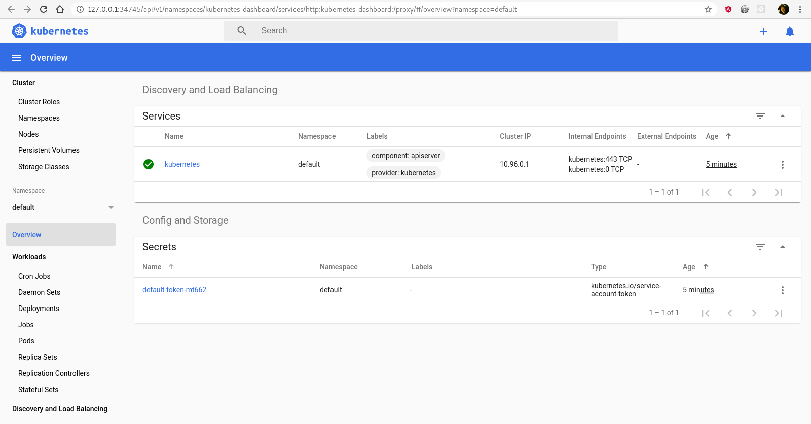
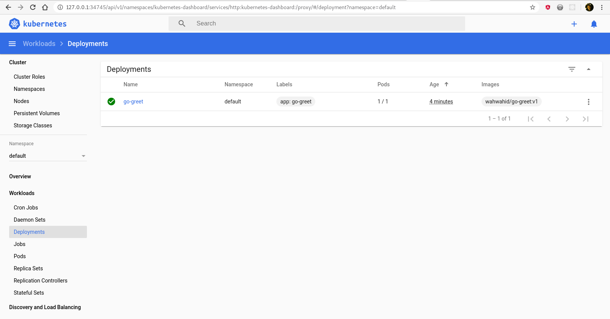
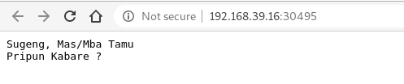
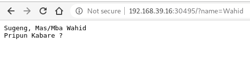

# UAS : Minikube untuk menjalankan Web App berbasis Go Lang

## Bagian A : Menyiapkan Web App dan Docker Image
### Step 1 : Inisialisasi go module
```bash
$ go mod init github.com/callicoder/go-docker

go: creating new go.mod: module github.com/callicoder/go-docker
```

Akan muncul suatu file "go.mod"
```go
module github.com/callicoder/go-docker

go 1.12

require (
	github.com/gorilla/mux v1.7.3
	gopkg.in/natefinch/lumberjack.v2 v2.0.0
)
```

### Step 2 : Membuat file program utama "server.go"
```go
package main

import (
	"context"
	"fmt"
	"log"
	"net/http"
	"os"
	"os/signal"
	"syscall"
	"time"

	"github.com/gorilla/mux"
	"gopkg.in/natefinch/lumberjack.v2"
)

func handler(w http.ResponseWriter, r *http.Request) {
	query := r.URL.Query()
	name := query.Get("name")
	if name == "" {
		name = "Tamu"
	}
	log.Printf("Received request for %s\n", name)
	w.Write([]byte(fmt.Sprintf("Sugeng, Mas/Mba %s\nPripun Kabare ?", name)))
}

func main() {
	// Create Server and Route Handlers
	r := mux.NewRouter()

	r.HandleFunc("/", handler)

	srv := &http.Server{
		Handler:      r,
		Addr:         ":8080",
		ReadTimeout:  10 * time.Second,
		WriteTimeout: 10 * time.Second,
	}

	// Configure Logging
	LOG_FILE_LOCATION := os.Getenv("LOG_FILE_LOCATION")
	if LOG_FILE_LOCATION != "" {
		log.SetOutput(&lumberjack.Logger{
			Filename:   LOG_FILE_LOCATION,
			MaxSize:    500, // megabytes
			MaxBackups: 3,
			MaxAge:     28,   //days
			Compress:   true, // disabled by default
		})
	}

	// Start Server
	go func() {
		log.Println("Starting Server")
		if err := srv.ListenAndServe(); err != nil {
			log.Fatal(err)
		}
	}()

	// Graceful Shutdown
	waitForShutdown(srv)
}

func waitForShutdown(srv *http.Server) {
	interruptChan := make(chan os.Signal, 1)
	signal.Notify(interruptChan, os.Interrupt, syscall.SIGINT, syscall.SIGTERM)

	// Block until we receive our signal.
	<-interruptChan

	// Create a deadline to wait for.
	ctx, cancel := context.WithTimeout(context.Background(), time.Second*10)
	defer cancel()
	srv.Shutdown(ctx)

	log.Println("Shutting down")
	os.Exit(0)
}
```

### Step 3 : Membuat "Dockerfile" untuk aplikasi
```dockerfile
# Menggunakan basis image golang terbaru
FROM golang:latest

# Mengatur Working Directory di dalam container
WORKDIR /app

# Menyalin file go.mod
COPY go.mod ./

# Mendownload semua modul go yang menjadi dependensi
RUN go mod download

# Menyalin sourcecode dari direktori aktif ke Working Directory di dalam container
COPY . .

# Build aplikasi web berbasis go
RUN go build -o main .

# Expose port 8080
EXPOSE 8080

# Menjalankan aplikasi web
CMD ["./main"]
```

### Step 4 : Membuild docker image
#### Perintah build
```bash
$ sudo docker build -t wahwahid/go-greet:v1 .

Sending build context to Docker daemon 5.632 kB
Step 1/8 : FROM golang:latest
 ---> ed081345a3da
Step 2/8 : WORKDIR /app
 ---> Using cache
 ---> ba5948285fb8
Step 3/8 : COPY go.mod ./
 ---> Using cache
 ---> 24ea2e346fb2
Step 4/8 : RUN go mod download
 ---> Using cache
 ---> 5e2499c7e089
Step 5/8 : COPY . .
 ---> Using cache
 ---> a65c62b40a06
Step 6/8 : RUN go build -o main .
 ---> Using cache
 ---> aceb644f93cf
Step 7/8 : EXPOSE 8080
 ---> Using cache
 ---> d6f0b18f4fad
Step 8/8 : CMD ./main
 ---> Using cache
 ---> 5ade4ecaf2e5
Successfully built 5ade4ecaf2e5
```

#### Mengecek docker image
```
$ sudo docker images                         

REPOSITORY           TAG                 IMAGE ID            CREATED             SIZE
wahwahid/go-greet    v1                  5ade4ecaf2e5        3 minutes ago       812 MB
```

### Step 5 : Publish docker image
#### Login ke dockerhub
```bash
$ sudo docker login            

Login with your Docker ID to push and pull images from Docker Hub. If you don't have a Docker ID, head over to https://hub.docker.com to create one.
Username: wahwahid
Password: 
Login Succeeded
```

#### Push docker image
```bash
$ sudo docker push wahwahid/go-greet:v1

The push refers to a repository [docker.io/wahwahid/go-greet]
6c1acc5c24b9: Pushed 
29668ff5d416: Pushed 
c66206dd7dfc: Pushed 
35fae93da461: Pushed 
6eaf05476b5c: Pushed 
a11110758ab0: Mounted from library/golang 
fff4cf473cbd: Mounted from library/golang 
3d6d182dab88: Mounted from library/golang 
e6d60910d056: Mounted from library/golang 
b52c1c103fae: Mounted from library/golang 
6f1c84e6ec59: Mounted from library/golang 
dd5242c2dc8a: Mounted from library/golang 
v1: digest: sha256:15c6d0683811112c0b6b1d8bf41ae6fbd8f6f54bc7624ae6bb22b566320f1492 size: 2838
```

#### Docker image dapat di cek di https://hub.docker.com/r/wahwahid/go-greet


## Bagian B : Menyiapkan Minikube
### Step 1 : Menjalankan Minikube
#### Mengatur vm-driver
```bash
$ minikube config set vm-driver kvm2

⚠️  These changes will take effect upon a minikube delete and then a minikube start
```

#### Menjalankan minikube
```bash
$ minikube start     
                    
😄  minikube v1.6.2 on Fedora 30
✨  Selecting 'kvm2' driver from user configuration (alternates: [none])
💾  Downloading driver docker-machine-driver-kvm2:
    > docker-machine-driver-kvm2.sha256: 65 B / 65 B [-------] 100.00% ? p/s 0s
    > docker-machine-driver-kvm2: 13.86 MiB / 13.86 MiB  100.00% 1.76 MiB p/s 8
💿  Downloading VM boot image ...
    > minikube-v1.6.0.iso.sha256: 65 B / 65 B [--------------] 100.00% ? p/s 0s
    > minikube-v1.6.0.iso: 150.93 MiB / 150.93 MiB [] 100.00% 11.04 MiB p/s 14s
🔥  Creating kvm2 VM (CPUs=2, Memory=2000MB, Disk=20000MB) ...
🐳  Preparing Kubernetes v1.17.0 on Docker '19.03.5' ...
💾  Downloading kubeadm v1.17.0
💾  Downloading kubelet v1.17.0
🚜  Pulling images ...
🚀  Launching Kubernetes ... 
⌛  Waiting for cluster to come online ...
🏄  Done! kubectl is now configured to use "minikube"
💡  For best results, install kubectl: https://kubernetes.io/docs/tasks/tools/install-kubectl/
```

### Step 2 : Menjalankan Kubernetes dashboard di browser
```bash
$ minikube dashboard     

🔌  Enabling dashboard ...
🤔  Verifying dashboard health ...
🚀  Launching proxy ...
🤔  Verifying proxy health ...
🎉  Opening http://127.0.0.1:34745/api/v1/namespaces/kubernetes-dashboard/services/http:kubernetes-dashboard:/proxy/ in your default browser...
Opening in existing browser session.
```


## Bagian C : Melakukan Deployment dengan Kubernetes
### Step 1 : Membuat deployment
#### Membuat deployment bernama "go-greet" dengan image "wahwahid/go-greet:v1"
```bash
$ kubectl create deployment go-greet --image=wahwahid/go-greet:v1

deployment.apps/go-greet created
```

#### Mengecek hasil deployment, pada gambar dibawah masih sedang proses deploy
```bash
$ kubectl get deployments                       

NAME       READY   UP-TO-DATE   AVAILABLE   AGE
go-greet   0/1     1            0           2s
```

#### Mengecek hasil deployment, pada gambar dibawah proses deploy selesai
```bash
$ kubectl get deployments

NAME       READY   UP-TO-DATE   AVAILABLE   AGE
go-greet   1/1     1            1           2m1s
```

#### Daftar deployment juga dapat dilihat di dashboard


#### Melihat daftar Pod(s)
```bash
$ kubectl get pods

NAME                       READY   STATUS    RESTARTS   AGE
go-greet-f594c6b46-k5r89   1/1     Running   0          5m25s
```

#### Melihat event cluster
```bash
$ kubectl get events

LAST SEEN   TYPE      REASON                    OBJECT                           MESSAGE
6m9s        Normal    Pulling                   pod/go-greet-f594c6b46-k5r89     Pulling image "wahwahid/go-greet:v1"
5m31s       Normal    Pulled                    pod/go-greet-f594c6b46-k5r89     Successfully pulled image "wahwahid/go-greet:v1"
5m30s       Normal    Created                   pod/go-greet-f594c6b46-k5r89     Created container go-greet
5m30s       Normal    Started                   pod/go-greet-f594c6b46-k5r89     Started container go-greet
6m10s       Normal    SuccessfulCreate          replicaset/go-greet-f594c6b46    Created pod: go-greet-f594c6b46-k5r89
39m         Normal    ScalingReplicaSet         deployment/go-greet              Scaled up replica set go-greet-66487fc4d9 to 1
9m49s       Normal    ScalingReplicaSet         deployment/go-greet              Scaled up replica set go-greet-59597d8c6f to 1
8m11s       Normal    ScalingReplicaSet         deployment/go-greet              Scaled up replica set go-greet-65d586f768 to 1
6m58s       Normal    ScalingReplicaSet         deployment/go-greet              Scaled up replica set go-greet-7466fc8596 to 1
6m10s       Normal    ScalingReplicaSet         deployment/go-greet              Scaled up replica set go-greet-f594c6b46 to 1
49m         Normal    NodeHasSufficientMemory   node/minikube                    Node minikube status is now: NodeHasSufficientMemory
49m         Normal    NodeHasNoDiskPressure     node/minikube                    Node minikube status is now: NodeHasNoDiskPressure
49m         Normal    NodeHasSufficientPID      node/minikube                    Node minikube status is now: NodeHasSufficientPID
49m         Normal    RegisteredNode            node/minikube                    Node minikube event: Registered Node minikube in Controller
49m         Normal    Starting                  node/minikube                    Starting kubelet.
49m         Normal    NodeHasSufficientMemory   node/minikube                    Node minikube status is now: NodeHasSufficientMemory
49m         Normal    NodeHasNoDiskPressure     node/minikube                    Node minikube status is now: NodeHasNoDiskPressure
49m         Normal    NodeHasSufficientPID      node/minikube                    Node minikube status is now: NodeHasSufficientPID
49m         Normal    NodeAllocatableEnforced   node/minikube                    Updated Node Allocatable limit across pods
49m         Normal    Starting                  node/minikube                    Starting kube-proxy.
```

#### Melihat konfigurasi "kubectl"
```bash
$ kubectl config view

apiVersion: v1
clusters:
- cluster:
    certificate-authority: /home/wahid/.minikube/ca.crt
    server: https://192.168.39.16:8443
  name: minikube
contexts:
- context:
    cluster: minikube
    user: minikube
  name: minikube
current-context: minikube
kind: Config
preferences: {}
users:
- name: minikube
  user:
    client-certificate: /home/wahid/.minikube/client.crt
    client-key: /home/wahid/.minikube/client.key
```

## Bagian D : Membuat suatu service di Kubernetes
### Step 1 : Membuat service dengan mengekspose deployment go-greet port 8080
```bash
$ kubectl expose deployment go-greet --type=LoadBalancer --port=8080

service/go-greet exposed
```

### Step 2 : Melihat Service yang tersedia 
```bash
$ kubectl get services

NAME         TYPE           CLUSTER-IP    EXTERNAL-IP   PORT(S)          AGE
go-greet     LoadBalancer   10.96.192.2   <pending>     8080:30495/TCP   45s
kubernetes   ClusterIP      10.96.0.1     <none>        443/TCP          70m
```

Terlihat port 8080 milik go-greet terekspose ke port 30495

### Step 3 : Membuka Service
```bash 
$ minikube service go-greet

|-----------|----------|-------------|----------------------------|
| NAMESPACE |   NAME   | TARGET PORT |            URL             |
|-----------|----------|-------------|----------------------------|
| default   | go-greet |             | http://192.168.39.16:30495 |
|-----------|----------|-------------|----------------------------|
🎉  Opening service default/go-greet in default browser...
```

Setelah perintah dijalankan, browser akan terbuka sesuai URL dari service ke public dalam hal ini http://192.168.39.16:30495



